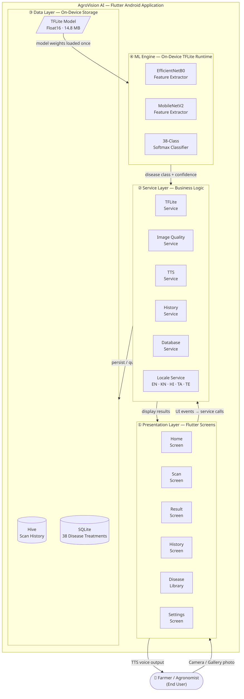
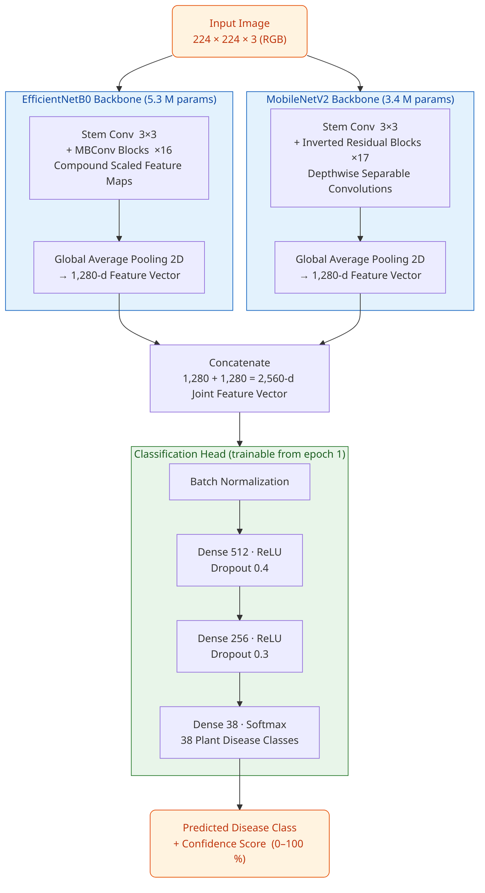
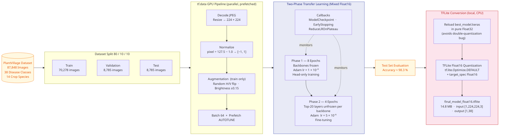
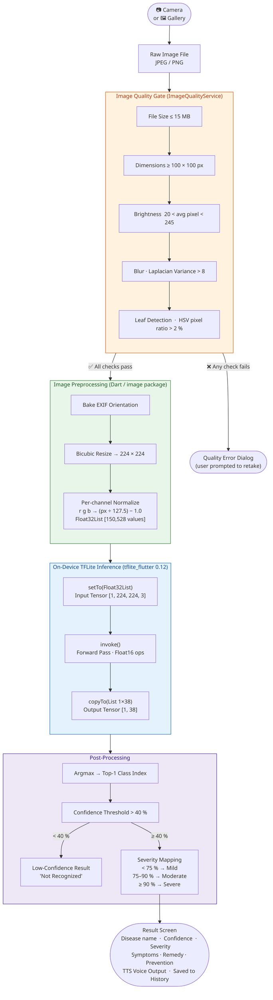
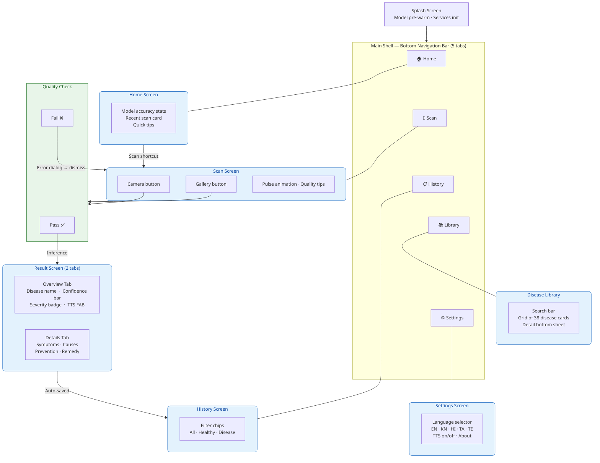

# AgroVision AI — Architecture Diagrams

> **How to export high-quality images:**
> 1. Go to **https://mermaid.live**
> 2. Paste any diagram block below (including the ` ```mermaid ` fences)
> 3. Click **Export → SVG** (vector, infinite resolution — best for paper/report)
>    or **Export → PNG** at 4× scale for slides
>
> Alternatively, open this file in **VS Code** with the _Mermaid Preview_ extension.

---

## Fig. 1 — Overall System Architecture

*Use in: paper (Section III — System Design), report cover architecture section, PPT slide 4–5*



---

## Fig. 2 — Dual-Backbone CNN Model Architecture

*Use in: paper (Section IV — Proposed Model), report model section, PPT slide 7–8*
*This is the most important diagram for the research paper.*



---

## Fig. 3 — Model Training Pipeline

*Use in: paper (Section V — Methodology), report training section, PPT slide 9–10*



---

## Fig. 4 — Mobile App Inference Pipeline (End-to-End)

*Use in: paper (Section VI — Implementation), report inference section, PPT slide 11–12*



---

## Fig. 5 — Application Screen Navigation Flow

*Use in: report UX section, PPT slide 6, final project report*



---

## Quick Reference — What to use where

| Diagram | Paper Section | Report Chapter | PPT Slide |
|---|---|---|---|
| Fig. 1 — System Architecture | III. System Design | Architecture Overview | 4–5 |
| Fig. 2 — CNN Model Architecture | IV. Proposed Model | Model Design | 7–8 |
| Fig. 3 — Training Pipeline | V. Methodology | Training & Conversion | 9–10 |
| Fig. 4 — Inference Pipeline | VI. Implementation | App Implementation | 11–12 |
| Fig. 5 — App Navigation | VII. User Interface | UX & Screens | 6 |

## Tech Stack Summary (for paper table)

| Component | Technology | Detail |
|---|---|---|
| Mobile Framework | Flutter 3.41 / Dart 3.11 | Android arm64 |
| ML Runtime | TFLite Flutter 0.12 | On-device, offline |
| Model | EfficientNetB0 + MobileNetV2 | Dual backbone, 38-class |
| Model Size | 14.8 MB (Float16) | Fits in app bundle |
| Dataset | PlantVillage | 87,848 images, 38 classes |
| Test Accuracy | ≈ 98.3 % | 8,785-image test split |
| Local DB | Hive + SQLite | History + treatment data |
| Languages | EN, KN, HI, TA, TE | Full UI + TTS |
| Min Android | API 21 (Android 5.0) | — |
